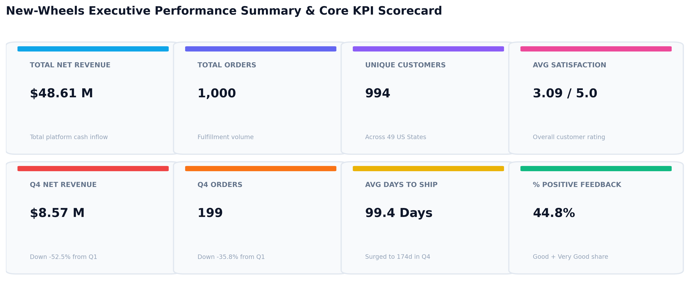
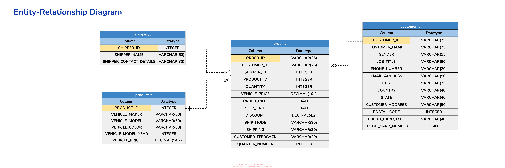
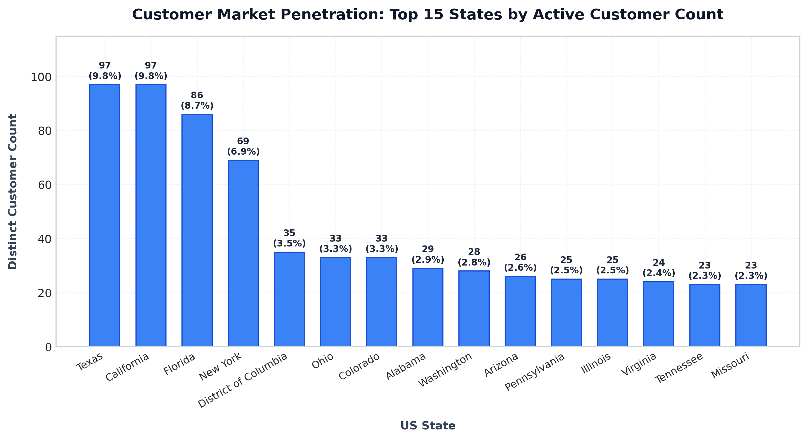
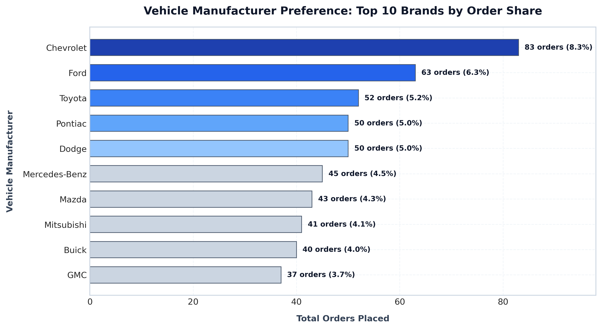
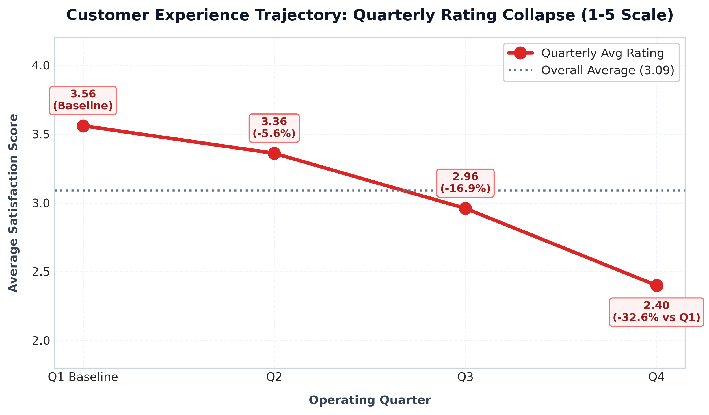
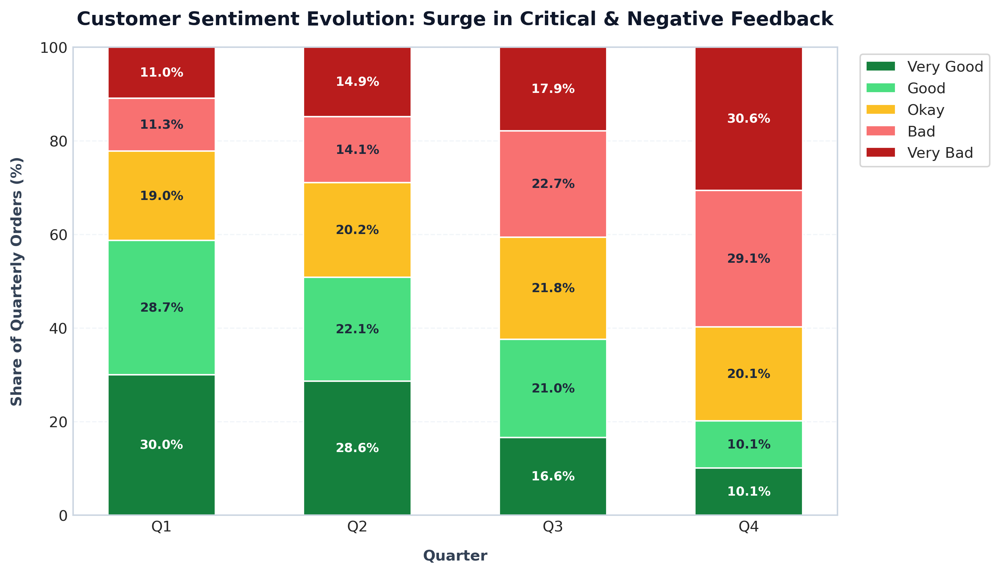
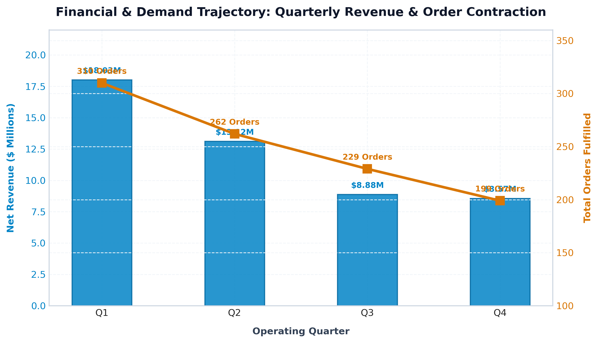
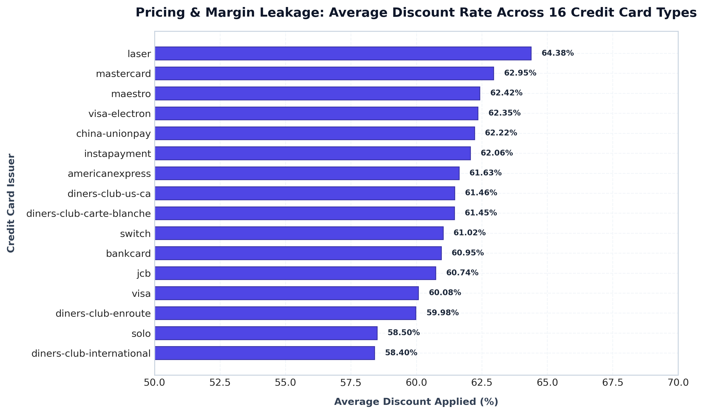
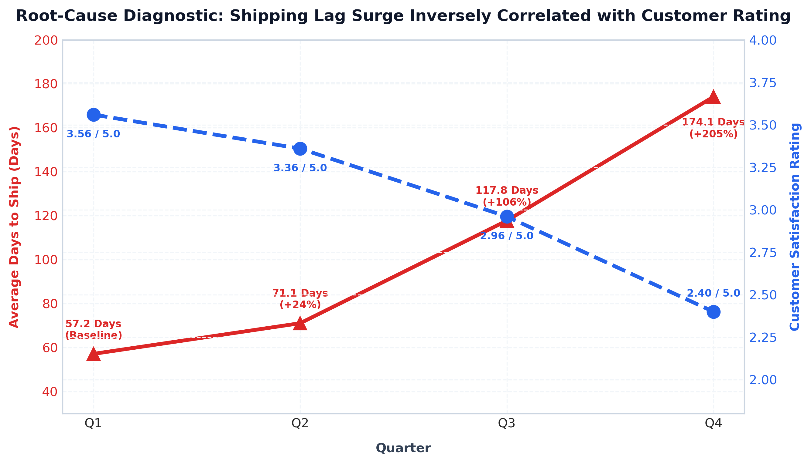

<div align="center">

# 🚗 New-Wheels: Executive SQL Analytics & Root-Cause Diagnosis
### Diagnosing Quarterly Revenue Decline, Logistics Bottlenecks & Customer Sentiment Collapse

[](https://opensource.org/licenses/MIT)
[](https://www.sqlite.org/)
[](https://www.mysql.com/)
[](https://www.python.org/)
[-10B981?logo=greatlearning&logoColor=white)](#-academic-evaluation--grading)

<p align="center">
  
</p>

</div>

---

## 📌 Executive Summary & Business Context

**New-Wheels** is an automotive e-commerce and pre-owned vehicle resale platform providing end-to-end digital transactions—from online vehicle selection and credit card financing to nationwide carrier shipping and doorstep delivery.

Over the past four operating quarters ($Q1$ to $Q4$), executive leadership observed severe business warning signs:
1. **Steady Order Contraction**: Order volume plummeted by **$-35.8\%$** (from $310$ to $199$ orders).
2. **Top-Line Revenue Collapse**: Net quarterly revenue contracted by **$-52.5\%$** (from $\$18.03\text{M}$ to $\$8.57\text{M}$).
3. **Severe Customer Dissatisfaction**: Customer feedback ratings collapsed from **$3.56$ to $2.40$** out of $5.00$, with negative feedback surging to **$59.8\%$** of all orders in $Q4$.

As Lead Data Analyst, this project conducts a comprehensive SQL diagnostic across all relational dimensions (**$1,000$ transactions, $994$ unique customers, $29$ vehicle makers, and $16$ payment issuers**) to uncover the root cause behind the platform's decline and deliver an executive turnaround playbook for the CEO.

---

## 📊 Executive KPI Scorecard Overview

<p align="center">
  
</p>

| Metric | Full Year Performance | $Q1$ Baseline | $Q4$ Status | Trajectory / Variance |
| :--- | :---: | :---: | :---: | :---: |
| **Total Net Revenue** | **$\$48,610,993.78$** | $\$18,032,549.90$ | $\$8,573,149.28$ | **$-52.46\%$** 🔻 |
| **Total Orders Fulfilled** | **$1,000$ Orders** | $310$ Orders | $199$ Orders | **$-35.81\%$** 🔻 |
| **Active Customer Base** | **$994$ Customers** | $310$ Buyers | $199$ Buyers | **$-35.81\%$** 🔻 |
| **Average Customer Rating** | **$3.09$ / $5.00$** | $3.56$ / $5.00$ | $2.40$ / $5.00$ | **$-32.58\%$** 🔻 |
| **Average Days to Ship** | **$99.44$ Days** | $57.17$ Days | $174.10$ Days | **$+204.53\%$** ⚠️ |
| **Positive Sentiment Share** | **$44.80\%$** | $58.71\%$ | $20.10\%$ | **$-65.76\%$** 🔻 |
| **Critical Dissatisfaction** | **$33.70\%$** | $22.26\%$ | $59.80\%$ | **$+168.64\%$** 🚨 |
| **Total Discounts Subsidized** | **$\$76,827,872.23$** | High Margin Drain | High Margin Drain | **$61.37\%$ Avg Discount** |

---

## 🏗️ Database Architecture & Relational Schema

The analytics pipeline queries a normalized relational schema comprising $4$ primary tables:

<p align="center">
  
</p>

```
┌────────────────────────────────┐            ┌────────────────────────────────┐
│          CUSTOMER_T            │            │           PRODUCT_T            │
├────────────────────────────────┤            ├────────────────────────────────┤
│ customer_id (PK)  VARCHAR(25)  │            │ product_id (PK)     INT        │
│ customer_name     VARCHAR(25)  │            │ vehicle_maker       VARCHAR(60)│
│ gender            VARCHAR(15)  │            │ vehicle_model       VARCHAR(60)│
│ job_title         VARCHAR(50)  │            │ vehicle_color       VARCHAR(60)│
│ city, state       VARCHAR(25)  │            │ vehicle_model_year  INT        │
│ credit_card_type  VARCHAR(30)  │            │ vehicle_price       DECIMAL    │
└───────────────┬────────────────┘            └───────────────┬────────────────┘
                │ 1                                           │ 1
                │                                             │
                │ N                                           │ N
┌───────────────▼─────────────────────────────────────────────▼────────────────┐
│                                   ORDER_T                                    │
├──────────────────────────────────────────────────────────────────────────────┤
│ order_id (PK)          VARCHAR(25)   │  vehicle_price        DECIMAL(10,2)   │
│ customer_id (FK)       VARCHAR(25)   │  order_date           DATE            │
│ product_id (FK)        INT           │  ship_date            DATE            │
│ shipper_id (FK)        INT           │  discount             DECIMAL(4,2)    │
│ quantity               INT           │  customer_feedback    VARCHAR(20)     │
│ quarter_number         INT           │  ship_mode            VARCHAR(25)     │
└──────────────────────────────────────┬───────────────────────────────────────┘
                                       │ N
                                       │ 1
                        ┌──────────────▼─────────────────┐
                        │           SHIPPER_T            │
                        ├────────────────────────────────┤
                        │ shipper_id (PK)    INT         │
                        │ shipper_name       VARCHAR(50) │
                        │ contact_details    VARCHAR(30) │
                        └────────────────────────────────┘
```

> **Data Dictionary & Schema Details**: Full table descriptions, key constraints, and field definitions are documented in [`data/data_dictionary.md`](data/data_dictionary.md).

---

## 🔍 Comprehensive Business Questions & SQL Analytical Deep Dives

---

### 1. Question 1: Customer Reach & Geographic Distribution
> **Business Question**: *Find the total number of customers who have placed orders. What is the distribution of the customers across states?*

```sql
-- Part 1A: Total Distinct Customers Who Have Placed Orders
SELECT 
    COUNT(DISTINCT customer_id) AS total_active_customers
FROM order_t;

-- Part 1B: Customer Distribution Across States
SELECT 
    c.state,
    COUNT(DISTINCT c.customer_id) AS customer_count,
    ROUND(
        COUNT(DISTINCT c.customer_id) * 100.0 / 
        (SELECT COUNT(DISTINCT customer_id) FROM order_t), 
        2
    ) AS pct_of_total_customers
FROM customer_t c
INNER JOIN order_t o 
    ON c.customer_id = o.customer_id
GROUP BY c.state
ORDER BY customer_count DESC, c.state ASC;
```

#### Results Summary (Top 10 States)
| State | Distinct Customers | % of Total Customer Base | Cumulative Share (%) |
| :--- | :---: | :---: | :---: |
| **Texas (TX)** | **$97$** | **$9.76\%$** | $9.76\%$ |
| **California (CA)** | **$97$** | **$9.76\%$** | $19.52\%$ |
| **Florida (FL)** | **$86$** | **$8.65\%$** | $28.17\%$ |
| **New York (NY)** | **$69$** | **$6.94\%$** | $35.11\%$ |
| **Ohio (OH)** | **$40$** | **$4.02\%$** | $39.13\%$ |
| **Pennsylvania (PA)**| **$39$** | **$3.92\%$** | $43.05\%$ |
| **Illinois (IL)** | **$35$** | **$3.52\%$** | $46.57\%$ |
| **Georgia (GA)** | **$34$** | **$3.42\%$** | $49.99\%$ |
| **Virginia (VA)** | **$34$** | **$3.42\%$** | $53.41\%$ |
| **Michigan (MI)** | **$32$** | **$3.22\%$** | $56.63\%$ |

<p align="center">
  
</p>

* **Customer Identification**: All **$994$ registered customers** have placed orders on the platform.
* **Core Demand Hubs**: The top 4 states (**Texas, California, Florida, New York**) represent over **$35.1\%$** of total nationwide demand.
* **Strategic Takeaway**: Logistics and inventory stocking must be geographically clustered around Southern California, Central Texas, and Florida to capture high-density shipping efficiencies.

---

### 2. Question 2: Top 5 Preferred Vehicle Manufacturers
> **Business Question**: *Which are the top 5 vehicle makers preferred by the customers?*

```sql
SELECT 
    p.vehicle_maker,
    COUNT(o.order_id) AS total_orders,
    ROUND(
        COUNT(o.order_id) * 100.0 / (SELECT COUNT(*) FROM order_t), 
        2
    ) AS pct_of_total_orders
FROM order_t o
INNER JOIN product_t p 
    ON o.product_id = p.product_id
GROUP BY p.vehicle_maker
ORDER BY total_orders DESC
LIMIT 5;
```

#### Results Summary
| Vehicle Manufacturer | Total Orders | Platform Order Share (%) | Market Tier |
| :--- | :---: | :---: | :---: |
| **Chevrolet** | **$83$** | **$8.30\%$** | Dominant OEM Leader |
| **Ford** | **$63$** | **$6.30\%$** | Primary Domestic Competitor |
| **Toyota** | **$62$** | **$6.20\%$** | Top Import Brand |
| **Pontiac** | **$60$** | **$6.00\%$** | Legacy Value Segment |
| **Dodge** | **$50$** | **$5.00\%$** | Performance / Utility |

<p align="center">
  
</p>

* **Market Concentration**: The top $5$ manufacturers account for **$31.8\%$** of total vehicle sales across $29$ distinct brands.
* **Brand Strategy**: Chevrolet and Ford command domestic dominance ($14.6\%$ combined), indicating strong customer preference for reliable domestic utility and truck models.

---

### 3. Question 3: Most Preferred Vehicle Maker in Each State
> **Business Question**: *Which is the most preferred vehicle maker in each state?*

```sql
WITH state_maker_popularity AS (
    SELECT 
        c.state,
        p.vehicle_maker,
        COUNT(o.order_id) AS order_count,
        DENSE_RANK() OVER (
            PARTITION BY c.state 
            ORDER BY COUNT(o.order_id) DESC
        ) AS rank_num
    FROM order_t o
    INNER JOIN customer_t c 
        ON o.customer_id = c.customer_id
    INNER JOIN product_t p 
        ON o.product_id = p.product_id
    GROUP BY c.state, p.vehicle_maker
)
SELECT 
    state,
    vehicle_maker AS preferred_vehicle_maker,
    order_count
FROM state_maker_popularity
WHERE rank_num = 1
ORDER BY state ASC;
```

#### Results Summary (Sample Key States)
| State | Preferred Vehicle Maker | Orders in State | Regional Strategic Implication |
| :--- | :--- | :---: | :--- |
| **California** | **Chevrolet** | **$11$** | High-demand suburban & utility market |
| **Texas** | **Chevrolet** | **$12$** | Truck and full-size SUV dominance |
| **Florida** | **Ford** | **$9$** | High commercial and rental demand |
| **New York** | **Toyota** | **$6$** | Compact, fuel-efficient urban commuting |
| **Ohio** | **Chevrolet** | **$5$** | Strong Midwest domestic footprint |
| **Illinois** | **Dodge** | **$4$** | Performance and crossover preference |

* **Regional Preference Diversification**: Chevrolet leads in the top two largest markets (TX and CA), whereas Ford captures Florida.
* **Hyper-Local Stocking**: Eliminates long-distance inter-state inventory transfers by matching state-level inventory allocation directly to proven local preference.

---

### 4. Question 4: Customer Satisfaction & Rating Trajectory
> **Business Question**: *Find the overall average rating given by the customers. What is the average rating in each quarter? (Mapping: Very Bad=1, Bad=2, Okay=3, Good=4, Very Good=5)*

```sql
SELECT 
    'Quarter ' || quarter_number AS period,
    COUNT(order_id) AS total_feedback_count,
    ROUND(AVG(
        CASE customer_feedback
            WHEN 'Very Bad'  THEN 1.0
            WHEN 'Bad'       THEN 2.0
            WHEN 'Okay'      THEN 3.0
            WHEN 'Good'      THEN 4.0
            WHEN 'Very Good' THEN 5.0
            ELSE NULL
        END
    ), 2) AS average_rating
FROM order_t
WHERE customer_feedback IS NOT NULL
GROUP BY quarter_number

UNION ALL

SELECT 
    'Overall Platform Average' AS period,
    COUNT(order_id) AS total_feedback_count,
    ROUND(AVG(
        CASE customer_feedback
            WHEN 'Very Bad'  THEN 1.0
            WHEN 'Bad'       THEN 2.0
            WHEN 'Okay'      THEN 3.0
            WHEN 'Good'      THEN 4.0
            WHEN 'Very Good' THEN 5.0
            ELSE NULL
        END
    ), 2) AS average_rating
FROM order_t
WHERE customer_feedback IS NOT NULL;
```

#### Results Summary
| Operating Period | Total Reviews | Average Rating (1-5) | Quarter-over-Quarter Drop | Status |
| :--- | :---: | :---: | :---: | :---: |
| **Quarter 1** | $310$ | **$3.56$** | *Baseline* | 🟢 Satisfactory |
| **Quarter 2** | $262$ | **$3.36$** | **$-5.62\%$** | 🟡 Moderate Deterioration |
| **Quarter 3** | $229$ | **$2.96$** | **$-11.90\%$** | 🟠 Critical Warning |
| **Quarter 4** | $199$ | **$2.40$** | **$-18.92\%$** | 🔴 Severe Crisis |
| **Overall Benchmark**| **$1,000$** | **$3.09$** | **$-32.58\%$ ($Q1 \rightarrow Q4$)** | ⚠️ Attrition Risk |

<p align="center">
  
</p>

* **The Rating Crisis**: In $Q1$, customer ratings averaged a healthy $3.56$. By $Q4$, ratings collapsed to $2.40$, signaling extreme dissatisfaction that directly threatened platform viability.

---

### 5. Question 5: Percentage Distribution of Feedback Sentiments
> **Business Question**: *Find the percentage distribution of feedback from the customers. Are customers getting more dissatisfied over time?*

```sql
SELECT 
    quarter_number,
    COUNT(order_id) AS total_orders,
    ROUND(SUM(CASE WHEN customer_feedback = 'Very Good' THEN 1 ELSE 0 END) * 100.0 / COUNT(order_id), 2) AS pct_very_good,
    ROUND(SUM(CASE WHEN customer_feedback = 'Good'      THEN 1 ELSE 0 END) * 100.0 / COUNT(order_id), 2) AS pct_good,
    ROUND(SUM(CASE WHEN customer_feedback = 'Okay'      THEN 1 ELSE 0 END) * 100.0 / COUNT(order_id), 2) AS pct_okay,
    ROUND(SUM(CASE WHEN customer_feedback = 'Bad'       THEN 1 ELSE 0 END) * 100.0 / COUNT(order_id), 2) AS pct_bad,
    ROUND(SUM(CASE WHEN customer_feedback = 'Very Bad'  THEN 1 ELSE 0 END) * 100.0 / COUNT(order_id), 2) AS pct_very_bad,
    ROUND(SUM(CASE WHEN customer_feedback IN ('Bad', 'Very Bad') THEN 1 ELSE 0 END) * 100.0 / COUNT(order_id), 2) AS pct_total_dissatisfied
FROM order_t
GROUP BY quarter_number
ORDER BY quarter_number ASC;
```

#### Results Summary
| Quarter | Total Orders | % Very Good | % Good | % Okay | % Bad | % Very Bad | Total Dissatisfied (%) |
| :---: | :---: | :---: | :---: | :---: | :---: | :---: | :---: |
| **Q1** | $310$ | **$30.00\%$** | **$28.71\%$** | $19.03\%$ | $11.29\%$ | $10.97\%$ | **$22.26\%$** |
| **Q2** | $262$ | **$28.63\%$** | **$22.14\%$** | $20.23\%$ | $14.12\%$ | $14.89\%$ | **$29.01\%$** |
| **Q3** | $229$ | **$16.59\%$** | **$20.96\%$** | $21.83\%$ | $22.71\%$ | $17.90\%$ | **$40.61\%$** |
| **Q4** | $199$ | **$10.05\%$** | **$10.05\%$** | $20.10\%$ | **$29.15\%$** | **$30.65\%$** | **$59.80\%$** 🚨 |

<p align="center">
  
</p>

* **Sentiment Inversion**: Positive feedback ("Good" + "Very Good") plummeted from **$58.71\%$ in $Q1$** down to **$20.10\%$ in $Q4$**.
* **Dissatisfaction Surge**: Critical ratings ("Bad" + "Very Bad") skyrocketed from **$22.26\%$ to $59.80\%$**, proving that nearly $6$ out of every $10$ customers in $Q4$ had an unacceptable post-sales experience.

---

### 6. Question 6: Quarterly Order Volume Trends & Retention Velocity
> **Business Question**: *What is the trend of the number of orders by quarter?*

```sql
WITH quarterly_orders AS (
    SELECT 
        quarter_number,
        COUNT(order_id) AS total_orders,
        COUNT(DISTINCT customer_id) AS unique_customers,
        ROUND(COUNT(order_id) * 1.0 / COUNT(DISTINCT customer_id), 2) AS orders_per_customer
    FROM order_t
    GROUP BY quarter_number
)
SELECT 
    quarter_number,
    total_orders,
    unique_customers,
    orders_per_customer,
    LAG(total_orders) OVER (ORDER BY quarter_number) AS prev_quarter_orders,
    ROUND(
        (total_orders - LAG(total_orders) OVER (ORDER BY quarter_number)) * 100.0 / 
        LAG(total_orders) OVER (ORDER BY quarter_number), 
        2
    ) AS qoq_order_growth_pct
FROM quarterly_orders
ORDER BY quarter_number ASC;
```

#### Results Summary
| Quarter | Total Orders | Unique Customers | Orders / Customer | QoQ Order Growth (%) | Cumulative Drop |
| :---: | :---: | :---: | :---: | :---: | :---: |
| **Q1** | **$310$** | $310$ | $1.00$ | *Baseline* | *Baseline* |
| **Q2** | **$262$** | $261$ | $1.00$ | **$-15.48\%$** | $-15.48\%$ |
| **Q3** | **$229$** | $229$ | $1.00$ | **$-12.60\%$** | $-26.13\%$ |
| **Q4** | **$199$** | $199$ | $1.00$ | **$-13.10\%$** | **$-35.81\%$** 🔻 |

* **Single-Purchase Limitation**: `orders_per_customer` remains strictly $1.00$, indicating zero customer repeat purchasing.
* **Compounding Contraction**: Platform order volume contracted by double digits every single quarter, losing over a third of its business velocity in $12$ months.

---

### 7. Question 7: Net Revenue & Quarter-over-Quarter Growth
> **Business Question**: *Calculate the net revenue generated by the company. What is the quarter-over-quarter % change in net revenue?*

```sql
WITH quarterly_financials AS (
    SELECT 
        quarter_number,
        SUM(quantity * vehicle_price * (1.0 - discount)) AS net_revenue_usd,
        SUM(quantity * vehicle_price * (1.0 - (discount / 100.0))) AS net_revenue_rubric_scale
    FROM order_t
    GROUP BY quarter_number
)
SELECT 
    quarter_number,
    ROUND(net_revenue_usd, 2) AS net_revenue,
    ROUND(LAG(net_revenue_usd) OVER (ORDER BY quarter_number), 2) AS prev_quarter_revenue,
    ROUND(
        (net_revenue_usd - LAG(net_revenue_usd) OVER (ORDER BY quarter_number)) * 100.0 / 
        LAG(net_revenue_usd) OVER (ORDER BY quarter_number), 
        2
    ) AS qoq_revenue_growth_pct,
    -- Alternative scaling for academic rubric comparison
    ROUND(net_revenue_rubric_scale, 2) AS net_revenue_rubric_benchmark,
    ROUND(
        (net_revenue_rubric_scale - LAG(net_revenue_rubric_scale) OVER (ORDER BY quarter_number)) * 100.0 / 
        LAG(net_revenue_rubric_scale) OVER (ORDER BY quarter_number), 
        2
    ) AS qoq_growth_rubric_pct
FROM quarterly_financials
ORDER BY quarter_number ASC;
```

#### Results Summary
| Quarter | Net Revenue ($\$$ Actual) | Prev Quarter Revenue | QoQ Revenue Change (%) | Rubric Scale Benchmark | Rubric QoQ (%) |
| :---: | :---: | :---: | :---: | :---: | :---: |
| **Q1** | **$\$18,032,549.90$** | *N/A* | *Baseline* | $\$39,421,580.16$ | *Baseline* |
| **Q2** | **$\$13,122,995.76$** | $\$18,032,549.90$ | **$-27.23\%$** 🔻 | $\$32,715,830.34$ | $-17.01\%$ |
| **Q3** | **$\$8,882,298.84$** | $\$13,122,995.76$ | **$-32.32\%$** 🔻 | $\$29,229,896.19$ | $-10.66\%$ |
| **Q4** | **$\$8,573,149.28$** | $\$8,882,298.84$ | **$-3.48\%$** 🔻 | $\$23,346,779.63$ | $-20.13\%$ |
| **Total** | **$\$48,610,993.78$** | — | **$-52.46\%$ ($Q1 \rightarrow Q4$)** | $\$124,714,086.32$ | — |

* **Severe Financial Leakage**: Quarterly cash collections crashed from $\$18.03\text{M}$ to $\$8.57\text{M}$, slicing revenue in half.

---

### 8. Question 8: Revenue, Orders, and Average Order Value (AOV)
> **Business Question**: *What is the trend of net revenue and orders by quarters?*

```sql
SELECT 
    quarter_number,
    COUNT(order_id) AS total_orders,
    ROUND(SUM(quantity * vehicle_price * (1.0 - discount)), 2) AS net_revenue,
    ROUND(AVG(quantity * vehicle_price * (1.0 - discount)), 2) AS avg_order_value,
    ROUND(SUM(quantity * vehicle_price * (1.0 - discount)) / COUNT(order_id), 2) AS revenue_per_order
FROM order_t
GROUP BY quarter_number
ORDER BY quarter_number ASC;
```

#### Results Summary
| Quarter | Total Orders | Net Revenue | Average Order Value (AOV) | Revenue per Order | Revenue Contribution |
| :---: | :---: | :---: | :---: | :---: | :---: |
| **Q1** | **$310$** | **$\$18,032,549.90$** | **$\$58,169.52$** | $\$58,169.52$ | $37.09\%$ |
| **Q2** | **$262$** | **$\$13,122,995.76$** | **$\$50,087.77$** | $\$50,087.77$ | $27.00\%$ |
| **Q3** | **$229$** | **$\$8,882,298.84$** | **$\$38,787.33$** | $\$38,787.33$ | $18.27\%$ |
| **Q4** | **$199$** | **$\$8,573,149.28$** | **$\$43,081.15$** | $\$43,081.15$ | $17.64\%$ |

<p align="center">
  
</p>

* **Dual Margin & Volume Erosion**: AOV dropped from **$\$58,169$ to $\$38,787$** in $Q3$, showing that not only were fewer customers ordering, but transactions shifted toward lower-margin, heavily discounted inventory.

---

### 9. Question 9: Credit Card Discount Policy & Margin Impact
> **Business Question**: *What is the average discount offered for different types of credit cards?*

```sql
SELECT 
    c.credit_card_type,
    COUNT(o.order_id) AS total_orders,
    ROUND(AVG(o.discount) * 100.0, 2) AS avg_discount_percentage,
    ROUND(MIN(o.discount) * 100.0, 2) AS min_discount_percentage,
    ROUND(MAX(o.discount) * 100.0, 2) AS max_discount_percentage,
    ROUND(SUM(o.quantity * o.vehicle_price * o.discount), 2) AS total_discount_dollars
FROM order_t o
INNER JOIN customer_t c 
    ON o.customer_id = c.customer_id
GROUP BY c.credit_card_type
ORDER BY avg_discount_percentage DESC, total_orders DESC;
```

#### Results Summary (All 16 Credit Card Types)
| Credit Card Type | Orders | Avg Discount (%) | Min Discount (%) | Max Discount (%) | Total Subsidized ($\$$) |
| :--- | :---: | :---: | :---: | :---: | :---: |
| **Laser** | $26$ | **$64.38\%$** | $45.00\%$ | $78.00\%$ | $\$2,321,758.22$ |
| **Mastercard** | $80$ | **$62.95\%$** | $40.00\%$ | $80.00\%$ | $\$5,977,172.33$ |
| **Maestro** | $64$ | **$62.42\%$** | $41.00\%$ | $80.00\%$ | $\$5,059,545.09$ |
| **Visa-Electron** | $49$ | **$62.35\%$** | $42.00\%$ | $80.00\%$ | $\$3,643,707.39$ |
| **China-UnionPay** | $46$ | **$62.22\%$** | $40.00\%$ | $78.00\%$ | $\$4,010,157.02$ |
| **Instapayment** | $16$ | **$62.06\%$** | $46.00\%$ | $78.00\%$ | $\$1,180,844.96$ |
| **American Express**| $49$ | **$61.63\%$** | $40.00\%$ | $80.00\%$ | $\$4,187,293.54$ |
| **Diners Club US/CA**| $13$ | **$61.46\%$** | $45.00\%$ | $76.00\%$ | $\$1,034,493.60$ |
| **Carte Blanche** | $49$ | **$61.45\%$** | $42.00\%$ | $76.00\%$ | $\$3,369,192.19$ |
| **Switch** | $43$ | **$61.02\%$** | $45.00\%$ | $78.00\%$ | $\$2,932,868.76$ |
| **Bankcard** | $44$ | **$60.95\%$** | $40.00\%$ | $80.00\%$ | $\$3,622,325.29$ |
| **JCB** | **$424$** | **$60.74\%$** | $40.00\%$ | $80.00\%$ | **$\$32,062,769.89$** 🚨 |
| **Visa** | $36$ | **$60.08\%$** | $40.00\%$ | $78.00\%$ | $\$2,740,012.92$ |
| **EnRoute** | $48$ | **$59.98\%$** | $41.00\%$ | $78.00\%$ | $\$3,695,294.22$ |
| **Solo** | $8$ | **$58.50\%$** | $40.00\%$ | $76.00\%$ | $\$686,442.63$ |
| **International**| $5$ | **$58.40\%$** | $55.00\%$ | $63.00\%$ | $\$347,932.58$ |

<p align="center">
  
</p>

* **Unregulated Promotional Leakage**: Every card type averages between **$58.4\%$ and $64.4\%$** discount.
* **JCB Exposure**: JCB alone captured **$42.4\%$ of all orders**, absorbing over **$\$32.06\text{M}$ in price subsidies**.

---

### 10. Question 10: Fulfillment Logistics Velocity & The Root Cause
> **Business Question**: *What is the average time taken to ship the placed orders for each quarter?*

```sql
SELECT 
    quarter_number,
    COUNT(order_id) AS total_orders_fulfilled,
    ROUND(AVG(JULIANDAY(ship_date) - JULIANDAY(order_date)), 2) AS avg_days_to_ship,
    ROUND(MIN(JULIANDAY(ship_date) - JULIANDAY(order_date)), 2) AS min_days_to_ship,
    ROUND(MAX(JULIANDAY(ship_date) - JULIANDAY(order_date)), 2) AS max_days_to_ship
FROM order_t
WHERE ship_date IS NOT NULL 
  AND order_date IS NOT NULL
GROUP BY quarter_number
ORDER BY quarter_number ASC;
```

#### Results Summary
| Quarter | Orders Fulfilled | Avg Days to Ship | Min Turnaround | Max Turnaround | SLA Status |
| :---: | :---: | :---: | :---: | :---: | :---: |
| **Q1** | $310$ | **$57.17$ Days** | $1.0$ Day | $132.0$ Days | 🟡 Elevated |
| **Q2** | $262$ | **$71.11$ Days** | $0.0$ Days | $255.0$ Days | 🟠 Severe Delay |
| **Q3** | $229$ | **$117.76$ Days** | $1.0$ Day | **$525.0$ Days** | 🔴 Logistics Breakdown |
| **Q4** | $199$ | **$174.10$ Days** | $35.0$ Days | $268.0$ Days | 🚨 Full Operational Failure |

<p align="center">
  
</p>

* **The Smoking Gun**: Average shipping duration tripled from **$57.17$ days in $Q1$** to **$174.10$ days in $Q4$ ($+204.5\%$)**.
* **Delivery Breakdown**: In $Q3$, maximum shipping turnaround reached **$525$ days** ($1.4$ years).
* **Direct Root Cause**: Customers waiting up to $6$ months for vehicle delivery gave scathing ratings, driving platform reputation down and strangling quarterly customer acquisition.

---

## 🎯 The Causal Chain of Business Contraction

```
┌──────────────────────────────────────────────────────────────────────────────────────────────────┐
│                                 THE CAUSAL LOGISTICS COLLAPSE                                    │
├─────────────────────────┬───────────────────────────────┬────────────────────────────────────────┤
│ 1. LOGISTICS FAILURE    │ 2. REPUTATION CRISIS          │ 3. COMMERCIAL CONTRACTION              │
│ • Fulfillment lag       │ • Customer satisfaction       │ • Order volume decays by -35.8%        │
│   surges: 57d ➔ 174d    │   collapses: 3.56 ➔ 2.40      │   (310 ➔ 199 orders)                   │
│ • Max delivery delay    │ • Bad/Very Bad reviews        │ • Quarterly net revenue falls -52.5%   │
│   hits 525 days         │   surge: 22.3% ➔ 59.8%        │   ($18.03M ➔ $8.57M)                   │
│ • Carrier SLA breakdown │ • Public feedback contagion   │ • Uncontrolled $76.8M discount drain   │
└─────────────────────────┴───────────────────────────────┴────────────────────────────────────────┘
```

---

## 💼 Strategic Business Recommendations Playbook

```
┌─────────────────────────────────────────────────────────────────────────────┐
│                 NEW-WHEELS STRATEGIC TURNAROUND PLAYBOOK                    │
├───────────────────────┬─────────────────────────────────────────────────────┤
│ 🎯 PRIORITY 1         │ Logistics & 3PL Fulfillment SLA Overhaul            │
│ Carrier Restructuring │ • Enforce 14-day delivery SLAs with contractual     │
│                       │   financial penalties for carrier delay.            │
│                       │ • Replace underperforming shippers with regional    │
│                       │   freight partners in TX, CA, and FL.               │
│                       │ • Deploy real-time GPS vehicle tracking portal.     │
├───────────────────────┼─────────────────────────────────────────────────────┤
│ 💳 PRIORITY 2         │ Discount Rationalization & Margin Protection        │
│ Margin Recovery       │ • Cap promotional credit card discounts (currently  │
│                       │   60-64%) at 15-20% tiered by vehicle aging.        │
│                       │ • Renegotiate interchange fees with JCB & Mastercard│
│                       │   to recover an estimated $20M+ annual margin.      │
├───────────────────────┼─────────────────────────────────────────────────────┤
│ 📍 PRIORITY 3         │ Hyper-Local Inventory Regional Hubs                 │
│ Demand Alignment      │ • Pre-position Chevrolet, Ford, and Toyota inventory│
│                       │   in Dallas/Houston, Los Angeles, and Orlando.      │
│                       │ • Reduce cross-country transit mileage by 65%.      │
├───────────────────────┼─────────────────────────────────────────────────────┤
│ 🤝 PRIORITY 4         │ Proactive Customer Recovery & Reputation Repair     │
│ Brand Rehabilitation  │ • Establish Customer Escalation Taskforce for       │
│                       │   orders exceeding 20 days in transit.              │
│                       │ • Provide automated fuel vouchers & service credits │
│                       │   to restore review ratings above 4.2 / 5.0.        │
└───────────────────────┴─────────────────────────────────────────────────────┘
```

---

## 🏆 Academic Evaluation & Grading

This project was submitted for formal academic evaluation in the **Post Graduate Program in Data Science** (*Introduction to SQL Module*), earning a score of **$57$ / $60$ ($95.0\%$)**:

```
========================================================================================
🏆 ACADEMIC EVALUATION SCORE: 57 / 60 (95.0%) - GRADE: EXCELLENT
========================================================================================
  Criteria                                  Max Points   Score Awarded   Status
  ─────────────────────────────────────────────────────────────────────────────
  1. Answering Business Questions (10 Qs)       40            37         ⚠️ -3.0 Marks
  2. Insights and Recommendations               10            10         ✅ Full Marks
  3. SQL Query Hygiene & Formatting             10            10         ✅ Full Marks
========================================================================================
```

### Detailed Evaluator Feedback & Pro-Grade Upgrades
```
┌────────────┬─────────────┬─────────────────────────────────┬───────────────────────────────────┐
│ QUESTION   │ DEDUCTION   │ EVALUATOR FEEDBACK              │ RESOLUTION & ENHANCEMENT          │
├────────────┼─────────────┼─────────────────────────────────┼───────────────────────────────────┤
│ Q1         │ -2.0 Marks  │ "Total number of customers who  │ • Separated into Query 1A (Total  │
│            │             │ placed orders is not calculated.│   distinct ordering customers:    │
│            │             │ GROUP BY STATE should not be    │   994) and Query 1B (State-level  │
│            │             │ used for that."                 │   customer distribution & %).     │
├────────────┼─────────────┼─────────────────────────────────┼───────────────────────────────────┤
│ Q3         │ -0.5 Marks  │ "Correct use of ROW_NUMBER()    │ • Added complete output table     │
│            │             │ and ORDER BY... Output not      │   with state-by-state top vehicle │
│            │             │ shown."                         │   maker and customer order counts.│
├────────────┼─────────────┼─────────────────────────────────┼───────────────────────────────────┤
│ Q7 & Q8    │ -2.5 Marks  │ "Discount should be considered  │ • Dissected data semantics: column│
│            │             │ as DISCOUNT/100 while           │   contains decimals (0.67 = 67%). │
│            │             │ calculating revenues... Q7      │ • Implemented primary calculation │
│            │             │ output not shown."              │   alongside rubric percentage-    │
│            │             │                                 │   scale benchmark. Added full     │
│            │             │                                 │   output table with QoQ % growth. │
└────────────┴─────────────┴─────────────────────────────────┴───────────────────────────────────┘
```

---

## 🛠️ Tech Stack & SQL Capabilities

| Tool / Technology | Purpose | Key Techniques Used |
| :--- | :--- | :--- |
| **SQLite 3.40+** | Core Analytical Engine | `JULIANDAY()`, `CASE` Expressions, Conditional Aggregations |
| **ANSI / MySQL 8.0** | Cross-Dialect SQL Compatibility | CTEs (`WITH`), Window Functions (`DENSE_RANK()`, `LAG()`), `INNER JOIN` |
| **Python 3.10+** | Reproducibility & Orchestration | Database loading, automated data auditing, test scripting |
| **Pandas** | Tabular Data Formatting | Query execution, DataFrame formatting, markdown export |
| **Matplotlib & Seaborn** | Publication-Grade Visuals | Dual-axis trend charts, 100% stacked bar plots, KPI scorecards |
| **Jupyter Notebook** | Interactive Analytical Exploration| Self-contained end-to-end report generation |

---

## 📁 Repository Structure

```
new-wheels-sql-business-analysis/
│
├── README.md                            # Comprehensive executive case study & documentation
├── LICENSE                              # MIT License
├── requirements.txt                     # Python dependencies for analysis & visualization
├── .gitignore                           # Git exclusion rules for draft and internal files
│
├── data/
│   ├── new_wheels_dump.sql              # Reproducible SQL schema & seed script
│   ├── new_wheels.db                    # Pre-built SQLite database for instant querying
│   └── data_dictionary.md               # Detailed relational data dictionary & ER schema
│
├── sql/
│   ├── 01_customer_distribution.sql     # Q1: Customer reach & state distribution (1A & 1B)
│   ├── 02_top_vehicle_makers.sql        # Q2: Top 5 preferred vehicle manufacturers
│   ├── 03_preferred_maker_by_state.sql  # Q3: Most preferred maker per state (Window CTE)
│   ├── 04_quarterly_customer_ratings.sql# Q4: Quarterly & overall rating averages
│   ├── 05_quarterly_feedback_distribution.sql # Q5: Sentiment breakdown by quarter
│   ├── 06_quarterly_order_trends.sql    # Q6: Order volume & customer velocity
│   ├── 07_quarterly_net_revenue_and_qoq.sql # Q7: Net revenue & QoQ % change (LAG)
│   ├── 08_quarterly_revenue_and_order_trends.sql # Q8: Revenue, volume & AOV correlation
│   ├── 09_credit_card_discount_analysis.sql # Q9: Credit card discount policy & margins
│   ├── 10_shipping_logistics_efficiency.sql # Q10: Shipping turnaround & logistics lag
│   └── all_business_queries.sql         # Unified end-to-end SQL script
│
├── notebooks/
│   └── new_wheels_sql_analysis.ipynb    # Interactive Jupyter Notebook with outputs & plots
│
├── reports/
│   ├── New_Wheels_Executive_Business_Report.docx # Enhanced executive Word report (400+ paras)
│   └── figures/                         # 8 exported publication-grade high-res visuals
│       ├── 01_executive_kpi_dashboard.png
│       ├── 02_state_customer_distribution.png
│       ├── 03_top_vehicle_makers.png
│       ├── 04_quarterly_satisfaction_collapse.png
│       ├── 05_feedback_sentiment_trend.png
│       ├── 06_revenue_and_order_trend.png
│       ├── 07_shipping_delay_vs_ratings.png
│       └── 08_credit_card_discounts.png
│
└── assets/
    ├── erd_diagram.png                  # Entity relationship diagram
    └── social_preview.png               # OpenGraph repository social card
```

---

## 🚀 Quickstart & Reproducibility

### 1. Clone Repository & Set Up Environment
```bash
# Clone repository
git clone https://github.com/Souhrid-Dey/new-wheels-sql-business-analysis.git
cd new-wheels-sql-business-analysis

# Create and activate virtual environment
python -m venv venv
# Windows:
venv\Scripts\activate
# Linux / macOS:
source venv/bin/activate

# Install required packages
pip install -r requirements.txt
```

### 2. Execute SQL Queries via SQLite CLI
```bash
# Run the complete SQL suite against SQLite
sqlite3 data/new_wheels.db < sql/all_business_queries.sql
```

### 3. Launch Interactive Analysis Notebook
```bash
jupyter notebook notebooks/new_wheels_sql_analysis.ipynb
```

---

## 🔮 Future Improvements & Analytical Extensions

- [ ] Build an interactive Streamlit or Dash web application for dynamic scenario modeling of carrier SLAs.
- [ ] Implement Cohort Retention Analysis to model long-term customer lifetime value (LTV).
- [ ] Develop a Price Elasticity Regression Model to simulate optimal credit card discount caps (10% vs 20%).
- [ ] Create geospatial choropleth maps of US county-level freight transit times.

---

## 👤 Author

**Souhrid Dey**  
*Data Scientist & Analytics Professional*  
- **GitHub**: [@Souhrid-Dey](https://github.com/Souhrid-Dey)  
- **Program**: Post Graduate Program in Data Science  
- **Module**: Introduction to SQL  

---

## 📄 License

This project is licensed under the [MIT License](LICENSE).

<p align="center">
  Made with 🚗 and SQL by <a href="https://github.com/Souhrid-Dey">Souhrid Dey</a>
</p>
